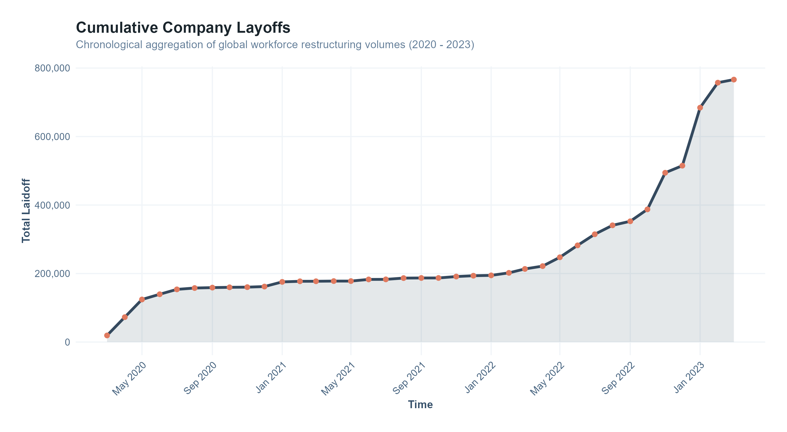
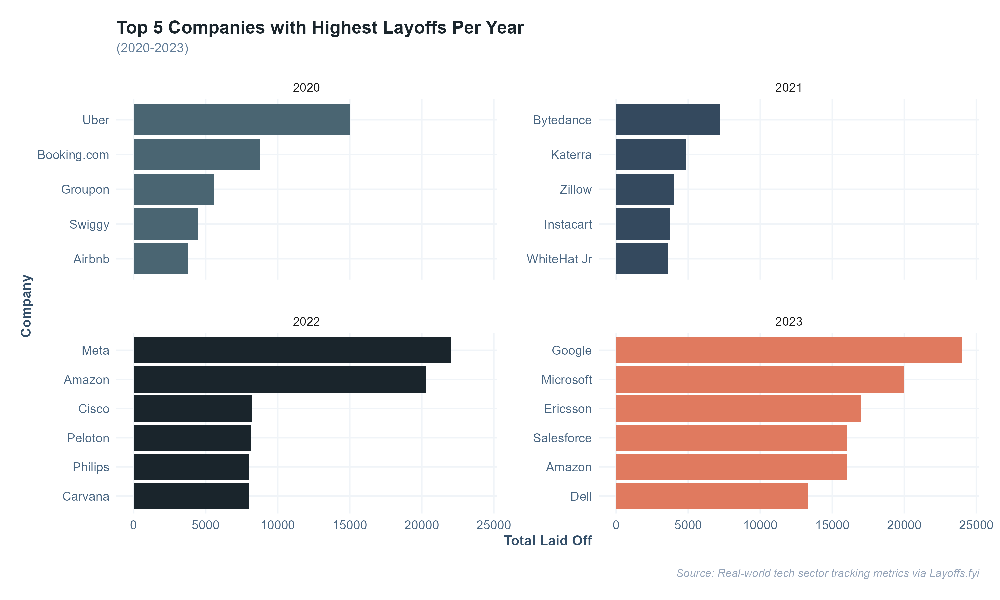

# Corporate Restructuring: All Sector Layoff Dynamics (2020 - 2023)

## 🔗 [👉 Interactive Report](https://ro-kamath.github.io/Company-Layoff-Dynamics-2020-2023-An-SQL-Analysis-in-R/)
---

## 📊 Project Overview
This data portfolio asset showcases an end-to-end analytical engineering pipeline. It addresses raw unstructured workforce disruption data by combining **SQL relation transforms** with an advanced **R/ggplot2 visualization framework** built on a unified corporate design system.

### 🛠️ Core Technology Architecture
* **Database Pipeline:** SQLite (Data Cleansing, Aggregations, Partitioned Window Run-Sums)
* **Statistical Graphics Engine:** R (tidyverse / `ggplot2` / `tidytext`)
* **Production Environment:** R Markdown (Self-Contained Dynamic HTML Stack)
* **Data Sources:** * Tech Sector Metrics: Real-world crowdsourced data via [Layoffs.fyi](https://layoffs.fyi/)
  * Institutional Mock Data: Practice schema configurations based on NBC's *Parks and Recreation*

---

## 📈 Key Visual Insights Showcase

### 1. Macroeconomic Trajectory (Cumulative Rolling Totals)
Using an explicit SQL Window frame (`SUM(Total_LaidOff) OVER(ORDER BY MONTH)`), this chart captures the escalating acceleration curve of global companies  separations over 3 years from 2020-2023.

* **Asset Output:** [Download High-Resolution Vector (PDF)](./assets/cumulative.pdf)

### 2. Annual Sector Standouts
A multi-faceted distribution plot mapping localized enterprise-scale restructuring impact vectors across distinct fiscal years.

* **Asset Output:** [Download High-Resolution Vector (PDF)](./assets/yearlytrend.pdf)

---

## 📂 Deliverables & Repository Map
* **`/index.html`**: The fully compiled production report containing embedded web tables and collapsible logic layers.
* **`/1st Foray into SQL in R.Rmd`**: The reproducible source code document utilizing custom `ggplot2` thematic object inheritance.
* **`/assets/`**: Print-ready, vector-graphic visualization files optimized for executive presentations and data slide decks.
